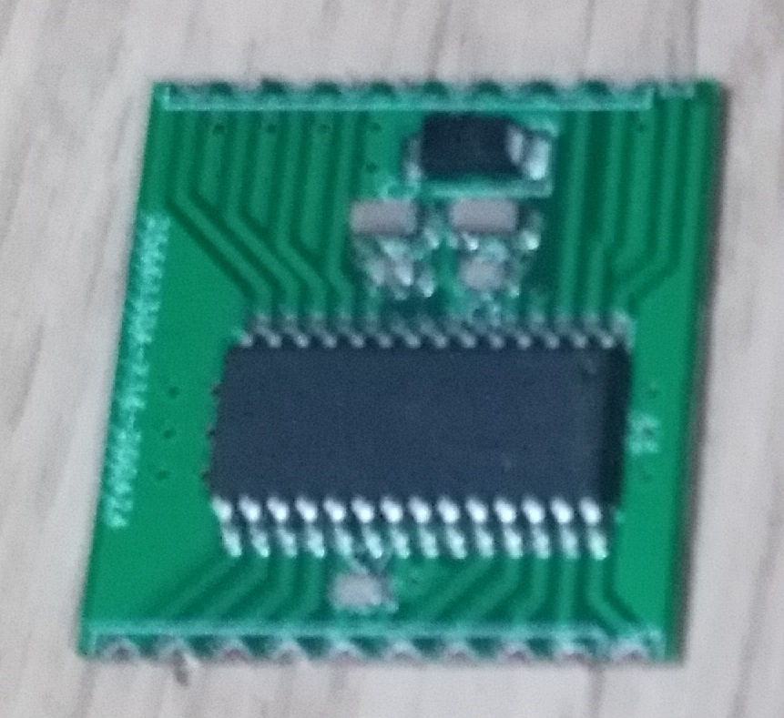

# 01_spi_pont_H
module pont H commandé en SPI // H bridge SPI drived module  

Version 2.0 of the CERN Open Hardware Licence: cern_ohl_p_v2.txt

Here picture as of 31/01/2021:

2021 05 21: la puce est obsolète.
L'utilisation en statique est bien.
Faire un pont H qui pilote un moteur oblige à "bombarder" le bus spi.

La carte est abandonnée.

